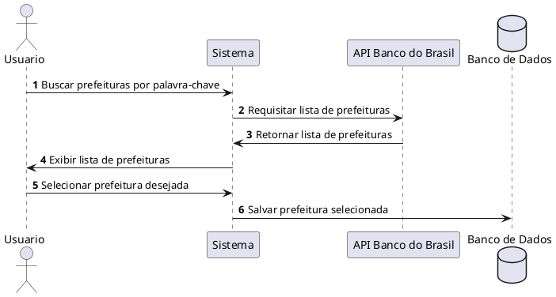
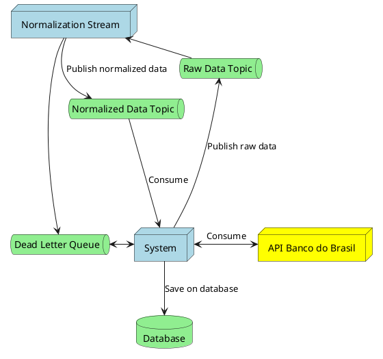
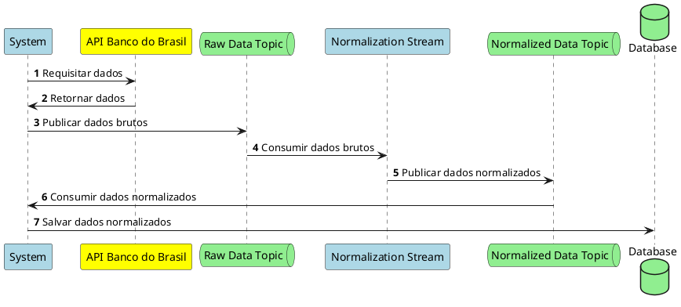

# Levatamento de Requisitos

## Funcionalidades
1. Criação de prefeituras
2. Criação de grupos de prefeituras
3. Geração de relatórios

## Descrição das funcionalidades

### 1. Criação de prefeituras

### 2. Criação de grupos de prefeituras
Documentar funcionalidade

### 3. Geração de relatórios
#### 3.1. Informações para relatório
- Receita (`Créditos - Redutores`)
- Dedução Fundeb
- Líquido

#### 3.2. Comparações
- Comparar com mês no anterior
- Comparar com mesmo mês no ano anterior
- Acumulado no mesmo período do ano anterior
- Acumulado em periodo especifico (OPCIONAL)
- Análise per capita (comparativo utilizando população) (OPCIONAL)

## Coleta de dados
### Fonte de dados
Para coleta de dados será utilizada a [api demonstrativos DAF](https://demonstrativos.apps.bb.com.br/arrecadacao-federal/listar) do Banco do Brasil.

### Processo de coleta
A [api](https://demonstrativos.apps.bb.com.br/arrecadacao-federal/listar) será utilizada para encontrar todos os dados de uma prefeitura num determinado mês.  
Para coleta de dados de um ano para prefeitura X, será necessário fazer 12 requisições, uma para cada mês

### Quando realizar o processo de coleta
O processo será feito em dois momentos:
- Quando uma nova prefeitura for adicionada, buscando os dados dos últimos 3 anos (36 requisições)
- Mensalmente, para atualizar os dados das prefeituras já cadastradas

### Problemas encontrados
- A [api](https://demonstrativos.apps.bb.com.br/arrecadacao-federal/listar) não retorna os dados de forma organizada, sendo necessário fazer um tratamento nos dados antes de publicar a mensagem.
- Para a normalização dos dados, foi criada uma arquitetura para garantir que o processo seja executado corretamente e de forma eficiente.

## Normalização de dados
### Arquitetura

### Diagrama de sequencia

### Descrição do processo
#### Antes de publicar mensagem
- Remover elementos em branco (`""`)
- Separar lista de receitas em grupos (FPM, ITR, ICS...)
    - Padrão: `ABC   - `, regex: `[A-Za-z]+\s+-\s`
- Criar entidade `Imposto` (entidade que representa um imposto em um mês)

#### Publicação de mensagem
- Para cada elemento das listas criadas, publicar mensagem, com `ID` do imposto e valor

### APIs de consulta e links uteis
- [API Banco do Brasil](https://demonstrativos.apps.bb.com.br/arrecadacao-federal/listar)
- [FECAM](https://www.fecam.org.br/transferencias/) (opção resumo)
